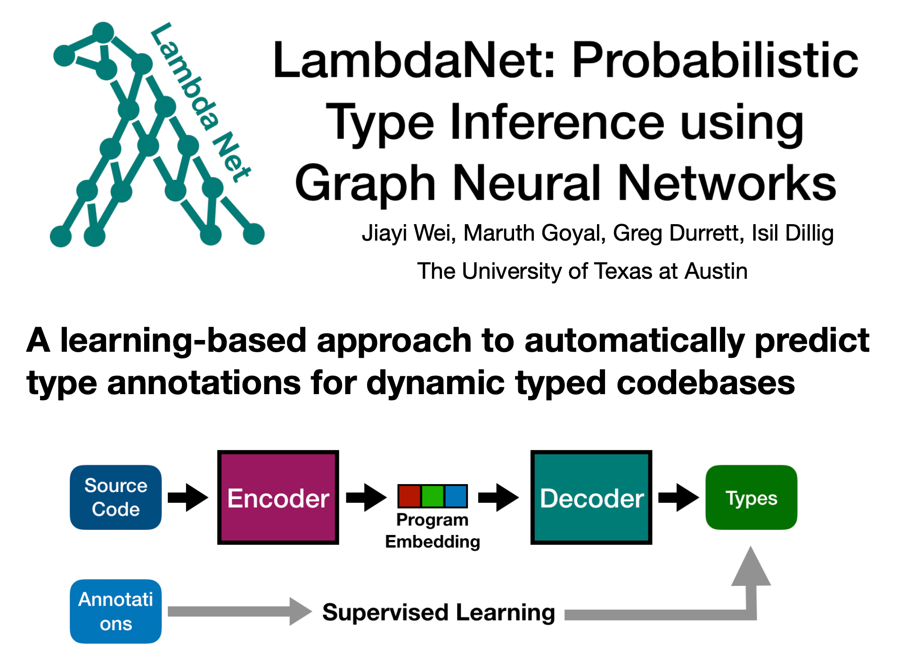

This is the source code repo for the ICLR paper [*LambdaNet: Probabilistic Type Inference using Graph Neural Networks*](https://openreview.net/forum?id=Hkx6hANtwH). For an overview of how LambdaNet works, see [our poster](https://github.com/MrVPlusOne/LambdaNet/raw/master/LambdaNet-Poster.pdf).

## Instructions
After cloning this repo, here are the steps to reproduce our experimental results (todo: provide scripts for these actions):

 - download the Typescript projects used in our experiments
 - filter and prepare the TS projects into a serialization format
 - start the training

The Typescript files used for manual comparison with JSNice are put under the directory `data/comparison/`.

### Running trained models
To run pre-trained LambdaNet models, check the file `src/main/scala/lambdanet/RunTrainedModel.scala` and change the parameters under the todo comments depending on which model you want to run and where your target TS files are located, then run program with this class as the main class (`sbt "runMain lambdanet.RunTrainedModel"`).

Model weights can be downloaded here (todo).

