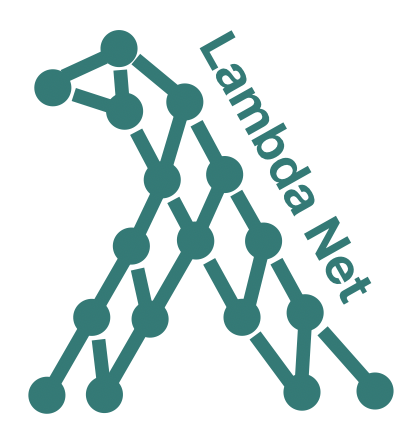

# LambdaNet

### Why Typescript?
The most popular option for adding types to Javascript codebases. Has a large number of real-world projects. Its optional gradual typing approach seems to be the simplest among different gradual typing paradigms. Also has a clear theoretical foundation (Siek et al).

### Typing Objective
Maximize the number of correct (user-annotated) type annotations.

### Why use machine learning?
 * Typescript has a very expressive and complex type system (to stay compatible with Javascript) that makes type inference a very challenging task. There is no efficient type inference algorithm for TS that is both sound and complete. 
 * No principle typing.
 * A human programmer can usually guess the correct types using naming information, textual documentation, and probabilistic reasoning (recognizing familiar code pattern). A machine learning algorithm might also learn to utilize these features.

### Tentative Solution
 * Encode Javascript programs as various typing constraints imposed on unknown variable types. 
 * Aggregate these constraints using a graph neural network. 
 * Use character-level naming information as additional features. 
 * Decode Typescript types from the vector embedding output by the GNN.

### Formalizations
See [typingNet-Formalizations.pdf](typingNet-Formalizations.pdf).

### Where are things
**Surface Language**: [GStmt](src/main/scala/lambdanet/GStmt.scala), [GExpr]([GStmt](src/main/scala/gtype/GExpr.scala))

**Typescript to DSL parser**: [ProgramParsing](src/main/scala/lambdanet/utils/ProgramParsing.scala)

**Intermediate Language**: [IR]([GStmt](src/main/scala/infer/IR.scala)), [IRTranslation]([GStmt](src/main/scala/infer/IRTranslation.scala))

**Relation Graph**: [RelationGraph](src/main/scala/infer/RelationGraph.scala)

**Graph Neural Network Embedding/Decoding**: [GraphEmbedding](src/main/scala/infer/GraphEmbedding.scala)

**Training Loop**: [TrainingCenter](src/main/scala/infer/TrainingCenter.scala)

### Current Progress

#### Inference Graph Construction

Todo: 

- [ ] properly handle library definitions

- [ ] implement predicate graph pruning

- [ ] collapse constant nodes

Done:

- [X] fix generic variables parsing

- [X] fix types parsing

- [X] implement type decoding from predicate graphs

- [X] implement user-defined type encoding

- [X] implement graph embedding of predicate graphs

- [X] generate predicate graph from IR

- [X] implement an IR in single assignment form (SAF)

- [X] translate programs ([GStmt](src/main/scala/lambdanet/GStmt.scala)) 
into IR

- [X] trace type variables back into source code

#### Fine-tuning training loop and neural architecture

Todo:

- [ ] obtain statistics about projects

- [ ] implement predicate-level loss

Done:

- [X] implement training loop for multiple projects

- [X] properly handle module imports/exports

- [X] translate real-world TS projects into our DSL

- [X] make the model capable of overfitting to a single program

- [X] investigate abnormal jumps in training loss 

(solution: updating with an RNN unit)

- [X] implement the training loop