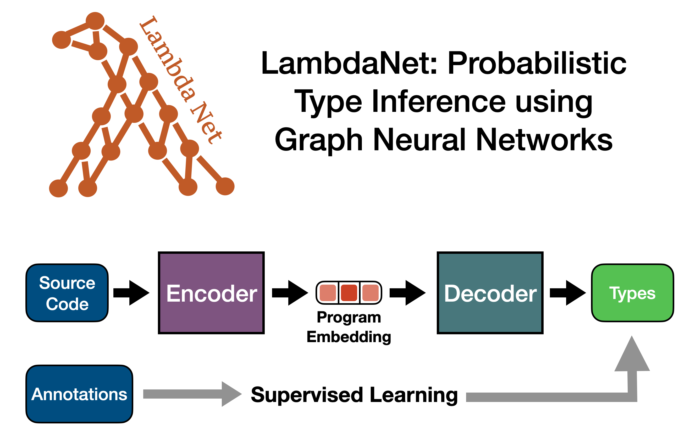

This is the source code repo for the ICLR paper [*LambdaNet: Probabilistic Type Inference using Graph Neural Networks*](https://openreview.net/forum?id=Hkx6hANtwH). For an overview of how LambdaNet works, see [our video from ICLR 2020](https://iclr.cc/virtual_2020/poster_Hkx6hANtwH.html).

This branch contains the latest improvement and features. To produce the results presented by the paper, please see the `ICLR20` branch.

## Instructions
After cloning this repo, here are the steps to reproduce our experimental results:

 1. Install all the dependencies (Java, sbt, Typescript, etc.) See the "Using Docker" section below.
 2. To run pre-trained model
    1. download the model weights using [this link (predicts user defined type)](https://drive.google.com/file/d/1NvEVQ4-5tC3Nc-Mzpu3vYeyEcaM_zEgV/view?usp=sharing) or [this link (only library types)](TODO), unzip the file, and put the `models` file under the project root. 
    2. To run the model in interative mode, which outputs `(source code position, predicted type)` pairs for the specified files:
        1. Under project root, run `sbt "runMain lambdanet.TypeInferenceService"`.
        2. After it finishes loading the model into memory, simply enter the directory path containing Typescript files.
        3. Note that currently, LambdaNet only works with Typescript files, so if you want to run it on Javascript files, you will need to change the file extensions to `.ts`.
    3. Alternatively, to run the model in batched mode, which outputs human-readable HTML files and accuracy statistics:
        1. download the [parsedRepos file](https://drive.google.com/file/d/1ZhsUf9bUzT3ZJB0KzNP6w2aj3sQZwtsp/view?usp=sharing), unzip the file and put the directory under `<project root>/data`.
        2. Check the file `src/main/scala/lambdanet/RunTrainedModel.scala` and change the parameters under the todo comments depending on which model you want to run and where your test TypeScript files are located.
        3. Under project root, use `sbt runTrained` to run the model.
 3. To train LambdaNet from scratch 
    1. Download the Typescript projects used in our experiments.
    2. Filter and prepare the TS projects into a serialization format.
    3. start the training.

The Typescript files used for manual comparison with JSNice are put under the directory `data/comparison/`.

### Using Docker
We also provide a Docker file to automatically download and install all the dependencies. Here are the steps to run pre-trained LambdaNet model inside a Docker Container: 

  1. First, make sure you have [installed Docker](https://www.docker.com/get-started).
  
  2. Put pre-trained model weights under `models/`.
   
  3. Under project root, run `docker build -t lambdanet:v1 .
  && docker run --name lambdanet --memory 14g -t -i lambdanet:v1 `. (Make sure the machine you are using has enough memory for the `docker run` command.)
  
  4. After the Docker container has successfully started, run `sbt runTrained`, and you should see LambdaNet outputs "libAccuracy" and "projectAccuracy" after a few minutes. LambdaNet also stores its predictions into an Html file under `<test TS project>/predictions/` (`<test TS project>` is currently default to `data/ts-algorithms`, but you can change this in `src/main/scala/lambdanet/RunTrainedModel.scala`.)
